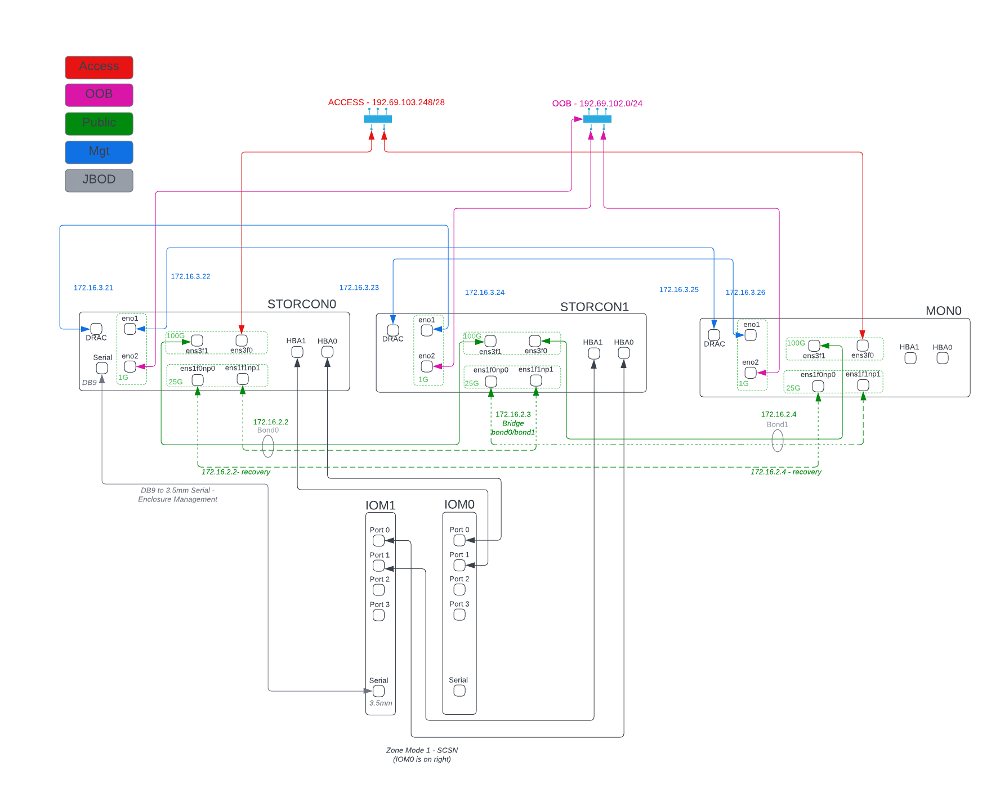

Gen2 Pod Overview
=================

The Gen2 Pod is the Open Storage Network's second-generation pod architecture
it provides similar storage capacity to the Gen1 rack appliance in a 7U 
footprint. The new pod is less complex to order, install, cable and manage
compared to the Gen1 appliance trading some component redundancy for 
a more compact hardware architecture. 

General Configuration
---------------------

The Gen2 Pod consists of three identical servers and a 106 drive JBOD. 

Data availability is supported via N+1 (i.e. 2+1) redundant server infrastructure.
If any server fails, operators can reconfigure the remaining two systems to take 
over for the failed machine. 

Data integrity is supported via 8:3 erasure coding; the array can withstand the loss
of three drives simultaneously without suffering data corruption.

Data confidentiality is supported via encryption at rest; all storage volumes are encrypted.

Comparison to Gen1
------------------

The Gen1 architecture consists of 8 servers: 3 monitor machines and 5 storage machines. Unlike the new architecture
where servers are interchangeable, Gen1 servers are split into data servers (36 drives/osds each) and monitors.

The Gen1 design implements N+1 redundancy of each server type; i.e. you can lose 
one dat server and/or one monitor server and continue to operate. 

The Gen1 N+1 redundancy requirement implies that the maximum EC code width, N+M, is 4 (5 dat servers - 1 redundant).
As a result we are limited to 3+1 erasure coding in the Gen1 design; only one disk may be
lost without data corruption.

Both designs represent tradeoffs. Gen1 pods will self-heal if a host fails, providing better availability
than the Gen2 pod which requires operator intervention. Gen2 pods, however, can guarantee data integrity with
up to three disk failures whereas the Gen1 pod can only tolerate a single disk failure.

The Gen2 tradeoff (self healing for better data integrity) was made based on the observation that servers 
don't frequently fail completely; they usually suffer degrading component failures and, that most failures do
not destroy all the data on connected disks. 

Gen2 Hardware
-------------

A Gen2 Pod is built from the following components

.. list-table::
  :header-rows: 1

  * - Quantity
    - Description
  * - 3
    - Dell PowerEdge R6515 1U Server
        | 2.5" Chassis with up to 10 NVME Drives
        | AMD 7702P 2GHz,64C/128T,256M,200W,3200
        | 8x 32GB RDIMM, 3200MT/s, Dual Rank 16Gb BASE x8
        | 2x Dell 960GB NVMe, Data Center Read Intensive Express Flash
        | SAS 12Gbps HBA External Controller, LP Adapter (Low profile right riser - slot 2)
        | PowerEdge R6515 Motherboard, with 2 x 1Gb Onboard LOM V2
        | Broadcom 57414 Dual Port 25GbE SFP28 LOM Mezz Card (slot 1)
        | Intel E810-CQDA2 Dual Port 100GbE QSFP28 Adapter (Low profile left riser - slot 3)
        | iDRAC9,Enterprise 15G
        | Dual, Hot Plug, Redundant Power Supply (1+1), 550W
  * - 1
    - Seagate Exos E4U106 JBOD
        | 4x mini-SAS HD I/O connectors
        | 106x 18TB SAS HDDs
        | 2x 2m SAS Cables
        | 2x 1G Ethernet RJ-45 protocols
  * - 1 
    - **Wiring Kit**

The wiring kit consists of cabling and transceivers used to connect the servers to one another 
to the JBOD and to the customer infrastructure.

.. list-table::
  :header-rows: 1

  * - QTY
    - ITEM

  * - Internal
    -
  * - 6
    - | sfp28-25gsr-85
      | https://www.fs.com/products/68264.html
      | Customized 25G SFP28 850nm 100m Transceiver Module - FS
      | Broadcom coded
  * - 6
    - | QSFP28-SR4-100G [1]_
      | https://www.fs.com/products/48568.html
      | Customized 100G QSFP28 100GBASE-SR4 Transceiver Module - FS
      | Intel Coded
  * - 2
    - | .3M MPO12 Cable
      | https://www.fs.com/products/68017.html
      | 12-Fiber MTP® OM4 trunk Cable 1m for 40G/100G Cabling - FS
      | .3M option on this cable (custom cable length)
  * - 3
    - | .3M LC/LC UPC OM4 Cable
      | https://www.fs.com/products/40180.html
      | LC UPC to LC UPC Duplex OM4 Multimode PVC (OFNR) 2.0mm Fiber Optic Patch Cable
      | .3M option on this cable
  * - 3
    - | 1ft Cat6 Ethernet Cable
      | https://www.fs.com/products/63440.html
      | 1ft (0.3m) Cat6 Snagless Unshielded (UTP) PVC CM Slim Ethernet Network Patch Cable, Blue
      | 1FT option on this cable
  * - 4
    - | HPE Mini-SAS HD 4x to Mini-SAS HD 4x Cable, 1m
      | https://www.connection.com/product/hpe-mini-sas-hd-4x-to-mini-sas-hd-4x-cable-1m/716195-b21/16883362
      | 1M Mini-SAS HD 4x to Mini-SAS HD 4x Cable
      | Would like a shorter cable
  * - 1
    - | Qaoquda DB9 9 Pin Female to 3.5mm Male Plug Serial Cable RS232 to 1/8 inch Conversion Cable Cord- 6FT/1.8M
      | https://www.amazon.com/Wpeng-Female-3-5mm-Serial-Conversion/dp/B06WLP4LTP
      | DB9 9 Pin Female to 3.5mm Male Plug Serial Cable RS232
      | Probably does not need to be 6' (maybe: https://www.cablestogo.com/usb-and-pc/computer-cables/serial-rs232/1-5ft-0-46m-velocity-db9-female-to-3-5mm-male-adapter-cable/p/cg-02445)

  * - Customer
    -
  * - 2
    - | QSFP28-SR4-100G [1]_
      | https://www.fs.com/products/48568.html
      | Customized 100G QSFP28 100GBASE-SR4 Transceiver Module - FS
      | Customer Coded
  * - 2
    - | 10M MPO12 Cable
      | https://www.fs.com/products/68017.html
      | 12-Fiber MTP® OM4 trunk Cable 1m for 40G/100G Cabling - FS
      | 10M option on this cable
  * - 3
    - | 30ft Cat6 Ethernet Cable
      | https://www.fs.com/products/63440.html
      | 30ft (0.3m) Cat6 Snagless Unshielded (UTP) PVC CM Slim Ethernet Network Patch Cable, Blue
      | 30FT option on this cable

.. [1] The link in the list above for the QSFP28-SR4-100G transceivers selects parts with MPO
   connectors and multimode fiber. Depending on customer site infrastructure a QSFP28-LR4-100G
   part may be more appropriate (https://www.fs.com/products/167795.html?attribute=25940&id=476628).
   This transceiver uses singlemode fiber and has a duplex LC connector.

Customer 100G Uplink
^^^^^^^^^^^^^^^^^^^^
Two (2) of the four (4) 100G transceivers listed in the "internal" section and the two (2)
100G transceivers listed in the "customer" section  of the wiring kit are for uplink from 
the pod to the customer's network. As such, the exact type of optical transport is 
site-specific. Customers will select either multimode connectivity (MPO connectors) or 
singlemode (LC connectors) based on whatever makes the most sense for their existing IT 
infrastructure. 

Design Synopsis
---------------
The pod runs Ceph, Quincy release on top of Rocky Linux 8.8. Cephadm is used to bootstrap
and provision the cluster. Storage controller 0 (storcon0) is used as the bootstrap node.
Storage controllers 0 and 1 are directly connected to the JBOD and act as OSD hosts. The
JBOD is zoned into a "split chassis shared nothing" configuration; each storage controller
"sees" a JBOD of 53 disks (half of the 106 disk array). The third server, mon0, is not connected
to the JBOD. All three servers run the the manager, monitor and rados gateway services.
External access is mediated by the ingress service which runs on storcon0 and mon0
(these are the machines with high-speed external access). Load is spread across the three servers
by the ingress service via HAProxy. The ingress provides HA IP via keepalived/vrrp. The 
RGW HA implementation is described in the `RGW Service Documentation`_.

.. _RGW Service Documentation: https://docs.ceph.com/en/latest/cephadm/services/rgw/

  Gen2 System Diagram

Networking
----------
The Gen2 Pod uese four networks which provide external access (to RGW services), out-of-band (OOB) administration,
server management and ceph communications. Note that the Gen2 Pod does not contain
a separate networking switch. Removing switching hardware from the design simplifies
configuration and Management, removes a point of failure and reduces cost. 

Access Networking
^^^^^^^^^^^^^^^^^
For the access network, the site provider is responsible for providing two (2) 100G L3 handoffs to the pod 
and three (3) publicly routed IP addresses. 

OOB Networking
^^^^^^^^^^^^^^
For out of band access, the site provider is responsible for providing three (3) copper 1G L3 handoffs and 
three (3) publicly routed IP address (preferably) on separate physical infrastructure from the 
Access Network. 

Server Management
^^^^^^^^^^^^^^^^^
The server management network is internal to the pod and provides access to the
BMC cards. Each server acts as a "jump host" to the BMC of one of its peers:

.. list-table::
  :header-rows: 1

  * - Jump Server
    - Reachable BMC
    - BMC Address
  * - storcon0
    - mon0
    - 172.16.3.25
  * - storcon1
    - storcon0
    - 172.16.3.21
  * - mon0
    - storcon1
    - 172.16.3.23

This allows remote, out of band BMC control for each of the
servers. The network used for these connections is 172.16.3.0/24

CEPH Public Network
^^^^^^^^^^^^^^^^^^^
The Ceph "public" network is a specific (unfortunately named) concept in the ceph architecture.
This network provides communication among the daemons that make up the storage system. You 
can learn more about ceph networking in the `Ceph Network Configuration Reference`_.
This is a 100G internal network and is is supported by a bridge on storcon1. Storcon0 
and mon0 connect to the bridge on storcon1 where storcon1 has virtual interface. 
Each server is connected to the bridge via a bonded pair of links (100G active / 25G standby).
Via this bridge, all three servers can communicate with one another at 100G. 

.. _Ceph Network Configuration Reference: https://docs.ceph.com/en/latest/rados/configuration/network-config-ref/

Let's Build a Minipod!!
=======================
The setup of a new pod consists of a
hardware installation and initialization step performed locally by the site administrator and 
a remote configuration step performed by the OSN team. 

* Site Administrator

  * Site Preparation
  * Physical Installation
  * Server Initialization
* OSN Remote DevOps

  * JBOD Configuration
  * AWX Playbooks

    * Preflight
    * Networking
    * Bootstrap
    * RGW
    * Keys
  * Validation

    * Dashboard functionality
    * Rclone upload test

Site Administrator
------------------
The site admin provisioning steps consist 
of preparing the site, purchasing and installing hardware and
installing the base operating system on the storcon0, storcon1 and mon0 servers.
The OSN team provides a disk image that the site administrator uses to install 
the operating system; this image is customized for each 
site using information provided to the OSN team by the site administrator.

Site Administrator Preflight
^^^^^^^^^^^^^^^^^^^^^^^^^^^^
* Order Hardware
* Provision Pod OOB Networking

  * 3x1G Copper access ports
  * 3x routed public IPs (specify IP address, gateway and netmask)
  * Outbound rules: tpc/http, tcp/https, tcp/dns, udp/ntp
    * Note, dns and ntp can be configured for internal resources
  * Inbound rules: ssh 

    * Can be source limited to OSN controller and monitoring nodes
      
      * ctl01.osn.mghpcc.org - 192.69.102.38
      * ctl02.osn.mghpcc.org - 192.69.102.51
      * ctl03.osn.mghpcc.org - 192.69.102.54
      * SDSC Nagios Server - 132.249.237.11
  * Verify using a test endpoint machine that connections work
* Provision Pod Access Networking

  * 2x100G QSFP28 access ports

    * Note that transceivers are specified in the cable kit BOM
      so all that is required from site IT is the provisioning of a 
      QSFP28 switchport
    * Jumboframes: Determine remote site MTU. Ping test.
  * 3x routed public IPs

    * One for each ingress host and a third for the VIP
  * Outbound rules: tcp/http, tcp/https
  * Inbound rules: tcp/http, tcp/https
  * Verify with test endpoint machine that connections work
* Submit Ticket for Custom Boot ISO (help@osn.mghpcc.org)

  * For each machine provide

    * Hostname (i.e. stocon0, storcon1 or mon0)
    * Service Tag
    * OOB IP Address, Gateway and Netmask
    * Access IP Address, Gateway and Netmask (only for mon0 and storcon0)
    * Access network MTU

.. note::
  All three machines are identical so which machine you 
  choose to be storcon0, storcon1 or mon0 does not matter as long as 
  they are cabled per the system diagram and that you provide the 
  correct service tag and IP information for the machines that you choose

Hardware Installation
^^^^^^^^^^^^^^^^^^^^^
* Install the hardware per the system diagram
* Make sure to correctly note the system tag information
  for each of the hosts.

Software Initialization
^^^^^^^^^^^^^^^^^^^^^^^

* Download the custom installer ISO generated from the help ticket request
* Copy the installer iso to a USB3.0 drive 12G or larger

  * sudo dd if=boot.iso of=/dev/sd<??> bs=4M status=progress oflag=direct
* For each Server

  * Connect usb keyboard, mouse and monitor
  * Insert the boot iso drive into a usb port
  * Power on the machine (or cycle if machine has been powered on)
  * Make sure machine is configured for UEFI boot
  * Hit F11 during power up sequence
  * Select the UEFI one shot option
  * Boot from boot iso drive
  * Confirm the OS installation

    * The machine should install the Rocky 8 Operating 
      system and reboot to a logon prompt.
  * Note that you will need an active internet connection during this process

* Once all three servers are initialized verify that you can ping the servers
  from an external IP address

.. note::
  At this point the servers are accessible over the internet and OSN 
  DevOps can take over the remaining provisioning steps.

OSN DevOps
----------
The site provisioning steps described above, prepare the servers for remote configuration.
The custom install image initializes networking and sets up the necessary
administrator accounts, passwords and keys so that OSN DevOPs can remotely
configure the storage cluster.

Custom Image Creation
^^^^^^^^^^^^^^^^^^^^^
Each pod is built from an installer customized to the pod site. The installer
is responsible for setting up a baseline Linux system on each of the three
hosts. The installer configures just enough software and networking 
to allow OSN DevOPs to access the machines remotely and provision the rest 
of the storage software.

Installer Design
""""""""""""""""
The site-specific OSN installer consists of a "stock" Rocky 8
installer with a custom kickstart that implements the following
customizations:

  * Custom repositories: The installer ships with customized
    disk monitoring tools.
  
  * Baseline networking packages: The software installs utilities needed 
    to configure the JBOD and the iDRAC IP addresses. (TODO...)

  * Ansible provisioning user: The installer creates a privileged
    user (osnadmin) and assigns initial credentials to the user. These 
    "bootstrap" credentials are changed as the first step of remote provisioning.

  * OOB networking - The installer iso encodes information provided by the pod site
    (Service Tag and Networking information) to configure the OOB network connection. 
    During installation, the installer inspects the serial number of the machine it is 
    installing on and uses that to choose the correct hostname and OOB IP settlings. 
    This customization is unique to each site.

ISO Builder
"""""""""""
The customized installer is built using a builder container via an image
located at docker.io/mghpcc/isobuilder. The builder image has all the source
assets and scripts needed to build the custom iso file. When the container is 
run from the container image it expects:

  * A bind mount at /data (within the container) for the output iso file
  * A bind mount at /tmp/inventory.yaml (withing the container) for the site inventory file
  * An environment variable set in the container with the root password for the installed system

When run with the above parameters, the container will generate a custom iso file named
boot.iso in the output directory used in the /data bind mount.

A convenience script, buildiso.sh, is provided to simplify the process of invoking the builder.
This script, a docker file and other associated assets used to create the isobuilder image
are located in the OSN github repository gen2-tools.

DevOPs Preflight
^^^^^^^^^^^^^^^^

  * Confirm networking
    
    * SSH to each machine using the bootstrap private key

      * Verify that osnadmin user has sudo privileges

    * Validate expected network device naming

      * ens3f0/1 - 100G devices, Intel NIC
      * ens1f0np0, ens1f1np1 - 25G devices, Broadcom NIC
      * eno8303, eno8403 - 1G devices - LOM
        * legacy naming is eno1, eno2
      * This could get cobbled due to wrong slot placement for the 
        25G and 100G nics or firmware changes (the Broadcom NICS changed
        names between driver updates)

  * Confirm/Configure JBOD

    * SCP fwdownloader application to storcon0
    * Logon to storcon0 
    * Run 'sudo ./fwdownloader -d 0 -CLI ver'
    * Note canister firmware version. If earlier than 5.2.0.137 (Oct 25, 2021) update

      * Update currently being done using UUT4.36_generic_cp_USMR2021.13.0_RC8_REL_redhat64
      * Follow instructions in same folder as updater

    * Run 'sudo ./fwdownloader -d 0 -CLI ver' again to confirm update
    * Run 'sudo ./fwdownloader -d 0 -CLI set_zone_mode' to confirm current zone mode
    * If zone mode is not 1

      * Run 'sudo ./fwdownloader -d 0 -CLI set_zone_mode 1' to set zone mode to 1
      * Run 'sudo ./fwdownloader -d 0 -CLI set_zone_mode' to confirm correct zone mode
      * Reboot storcon0/1 for good measure to make sure udev naming does its thing

    * Run 'ls /dev/disk/by-path | grep sas-exp | wc -l' on storcon0/1 and confirm that they each see 53 drives

  * Update AWX with new site information
  
    * Logon to the OSN AWX server and synchronize the project to fetch the new
      inventory file.
    * Create customized inventory file for the site and add it to AWX

      * This will likely be done during the ticket processing
      * Create the inventory file in the gen2-ansible/inventory directory
        * If necessary, override "all" group defaults by creating a site group folder
          and creating an overrides file there with the name <<site>>_group_vars_overrides.yaml
      * Commit and push the updated gen2-ansible repo to github
      * Logon to the AWX server and synchronize the project to fetch the new
        inventory file.
      * Create a new inventory for the new site in AWX
      * Edit the newly created inventory and select the "Sources" tab
      * Create an inventory source:

        * Choose AWX-CUSTOM for Execution environment
        * Select "Sourced from a Project" as source
        * Select "OSN Get2 Pod Project" from dropdown
        * Enter the inventory file name as "inventories/hosts.<site>.yaml" (where site is your sitename)
        * IMPORTANT: Hit CR to enter the file name - tabbing (confusingley) clears the text box and the dropdown is broken (does not correctly list inventory files)
        * Hit "Save" button
      
      * Sync source by pressing the refresh icon at the end of the list or edit the inventory source and press the "Sync" button

.. note::
  The most recent JBOD received (3/20/23) came with updated firmware 
  and was able to execute the array split command. Firmware
  updating will likely not be needed on install in the future. 

  

Replace Bootstrap Credentials
^^^^^^^^^^^^^^^^^^^^^^^^^^^^^

  * Navigate to the "1 - Minipod Credentials" workflow job template and execute

Configure Host
^^^^^^^^^^^^^^

  * Navigate to the "2 - Minipod Host Provisioning Workflow" workflow job template and execute
  * Note that this step will reboot the nodes
  * When nodes come back, validate intrapod connectivity

    * Confirm ping from-to each host on the cluster network
    * Confirm gateway ping on each of the external networks
    * confirm idrac ping on each of the hosts to their peer bmc interfaces

  * Verify IPMI connectivity (portforward idracs from each host)

.. note::
     You need to disable host header checking to support port forwarding

     * ssh to the idrac of each machine using root credentials
     * On the idrac issue ``set idrac.webserver.HostHeaderCheck 0``
     * **TODO** - can we set this via ipmi either in ansible or kickstart?

Bootstrap Storage Cluster
^^^^^^^^^^^^^^^^^^^^^^^^^

  * Navigate to the "3 - Minipod Install Ceph" workflow job template and execute
  * Logon to storcon0 and run "sudo cephadm ceph status"
  * Periodically run status to monitor the progress of the cluster build

    * You're looking for "HEALTH_OK" and 106 osds, 106 up, 106 in
    * Note that this can take up to an hour to complete.

Setup and Verify RGW
^^^^^^^^^^^^^^^^^^^^

  * Navigate to the "4- Minipod Install RGW Workflow" workflow job template and execute

    * Verify rgw and ingress services are up (ceph orch ls)
    * Curl the external interface to make sure that they respond and have valid certs

      * ``curl --insecure -vvI https://minipod.osn.mghpcc.org 2>&1 | 
        awk 'BEGIN { cert=0 } /^\* SSL connection/ { cert=1 } /^\*/ { if (cert) print }'``
    * Verify that you can access the dashboard

      * Get dashboard admin credentials and location 

        * Logon to storcon0
        * grep -A 5 Dashboard /var/log/ceph/cephadm.log

      * Portforward dashboard port (shown in grep above) from storcon0

    * Below will only work if bug is fixed that honors rgw_dns_name!!

      * Use the dashboard to create a testbucket
      * Get dashboard user credentials from users page

        * Select Object Gateway -> Users side-menu pick
        * turn down knob on gateway user
        * select keys tab
        * select dashboard username
        * click show button

    * Add minipod config to rclone using dashboard user credentials
    * Verify object upload/download to/from the minipod using the rclone config

Configure Accounts and Credentials
^^^^^^^^^^^^^^^^^^^^^^^^^^^^^^^^^^
  
    * Navigate to the "5 - Minipod Keys" workflow job template and execute
    * Running this workflow distributes all the public keys stored in the prod/site/all
      key. This includes the "site_public_key" item as well as all the keys listed in 
      site_authorized_keys list. This process is a replace not an update operation; if
      a key is not in the list or the site_public_key item, it will be removed from the
      authorized_keys file on the pod.

        * Note that in addition to operator keys, the osn portal provisioning key
          needs to be included here in the site_authorized_keys list.

    * This workflow also creates the nagios account used for monitoring

Let's Encrypt Job
^^^^^^^^^^^^^^^^^

The AWX template list contains a workflow called "Minipod Ingress Workflow". This 
workflow checks and updates pod certificates. Schedule this workflow to run
every week to ensure that the pod certificates are kept up to date.

  * Logon to AWX
  * Select "Templates" from the left menu
  * Select the "Minipod Ingress Workflow" workflow template from the list
  * Select "Schedules" from the top menu
  * Click the "Add Schedule" button
  * Enter a name for the schedule in the resulting form
  * Choose a start date and time for the schedule

    * Note, we should try to stagger request days and times so that we don't trigger the LE rate limit.
  * Click the "Repeat frequency" drop down and check "week" (this displays an extended form with more options)
  * Enter "1" for the "Run Every" value
  * Select a day of the week and check "Never" for the end date
  * Click the "Prompt" button (this lets you set the responses to prompts that the workflow generates when run)
  * In the "Inventory" section select the inventory corresponding to the pod and click "Next"
  * In the "Other Prompts" sections, choose yaml format and add --- (i.e. empty yaml doc)
  * Click "Next" to get to the prompts Preview page
  * Click "Save" to save the runtime prompt responses
  * Click "Save" on the resulting form to save the whole schedule

  
A Note About Secrets
^^^^^^^^^^^^^^^^^^^^

OSN secrets are stored as yaml in the AWS Secret Manager. Care must be taken
when modifying the secrets to maintain valid yaml. The trickiest part is the 
private key indentation. A convenience script "editsecret.sh" is provided to
facilitate editing secrets. This script will fetch the secret from AWS, open
the yaml in VIM and allow you to edit it as a normal file. Saving in the 
editor will save the secret back to AWS. To use the script, your AWS credentials
need to be available in the environment.

There is one AWS secret containing a yaml document for each site and 
an additional secret that contains information used by all sites. The 
secret keys are named "hiearchically" with the form "prod/site/<sitename>"
for the production pods. The key format anticipates other pod types (e.g. testing,
staging). The prod/site/all secret contains information common to all pods.

The information in the secrets is used by AWX to access the pods and to
set secret/senitive values on the pods (e.g. keys and passwords). 

An implementation detail worth noting is that a special AWX job template, "setup keys",
is used to read secrets and set/change values in a pre-defined AWX machine credential (minipodcred). 
This machine credential is referenced by all jobs that need to access pods. All OSN workflows
include the "setup keys" job as the first step in the workflow which retrieves the keys from 
AWS (the specific site/key to use is in the inventory file) and sets the values in the minipodcred
machine credential. Subsequent steps in the workflow that reference the minipodcred credential
then have the correct credential values needed to access the hosts in the workflow inventory.

In the future, we may decide to make AWX the source of credential truth and
avoid the need for the special job template. This will need to wait for a more
hardened AWX deployment and a validation of the security of the AWX secrets.
