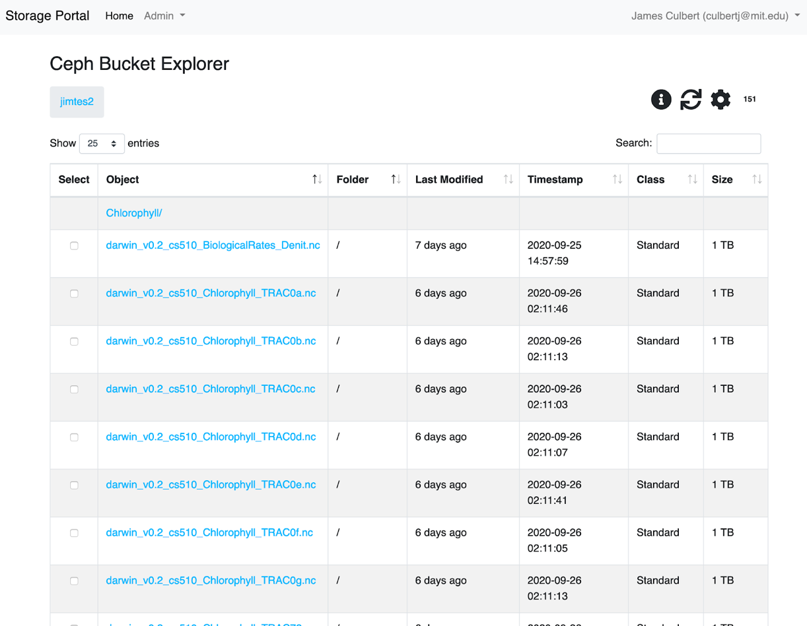
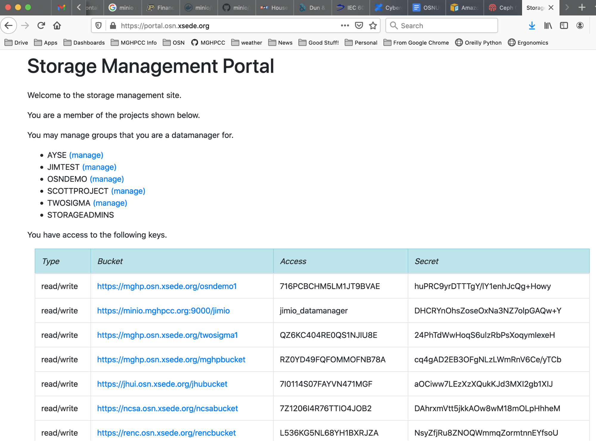
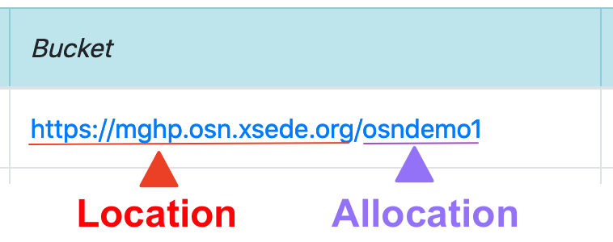
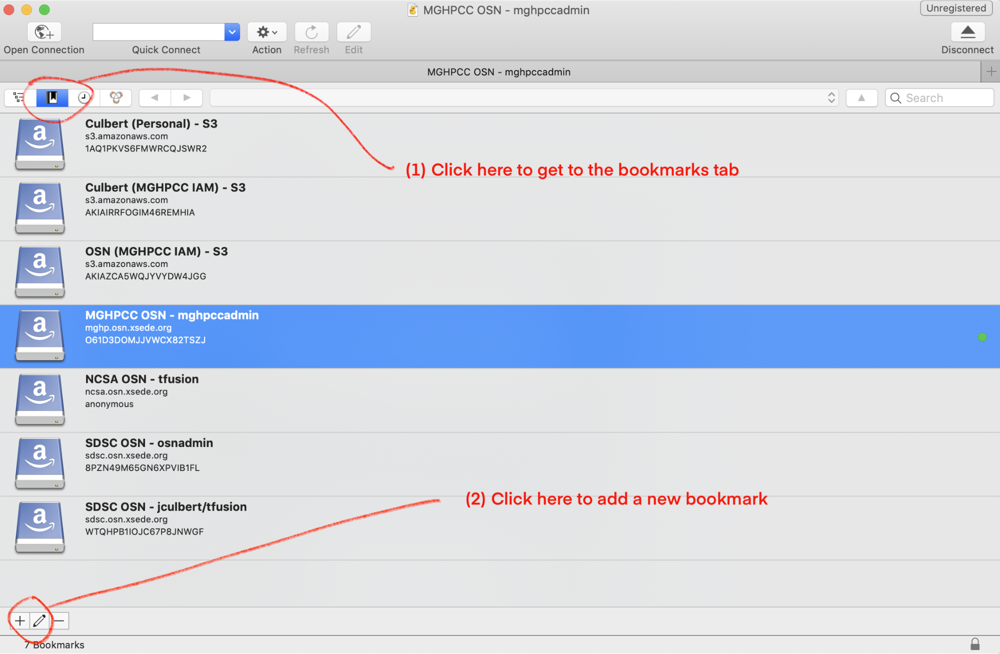
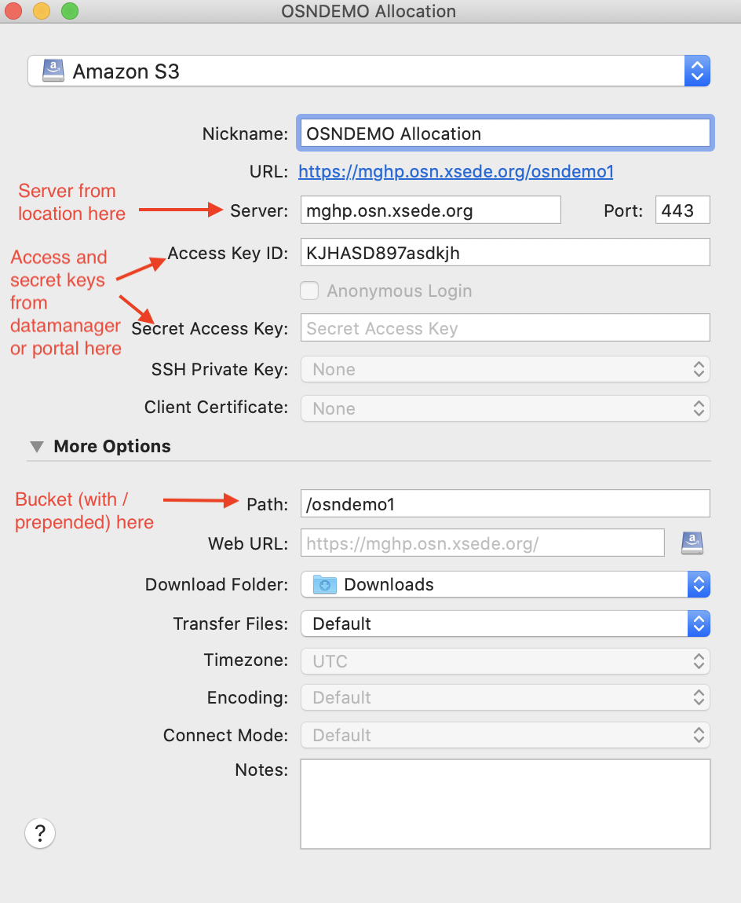
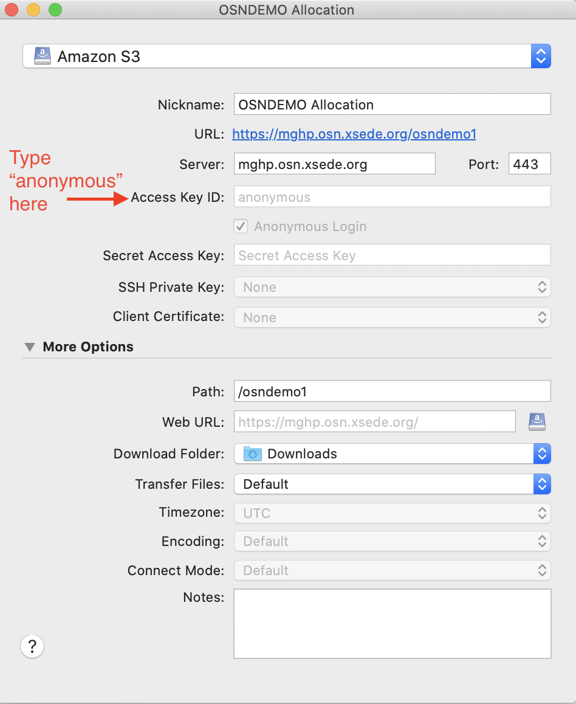
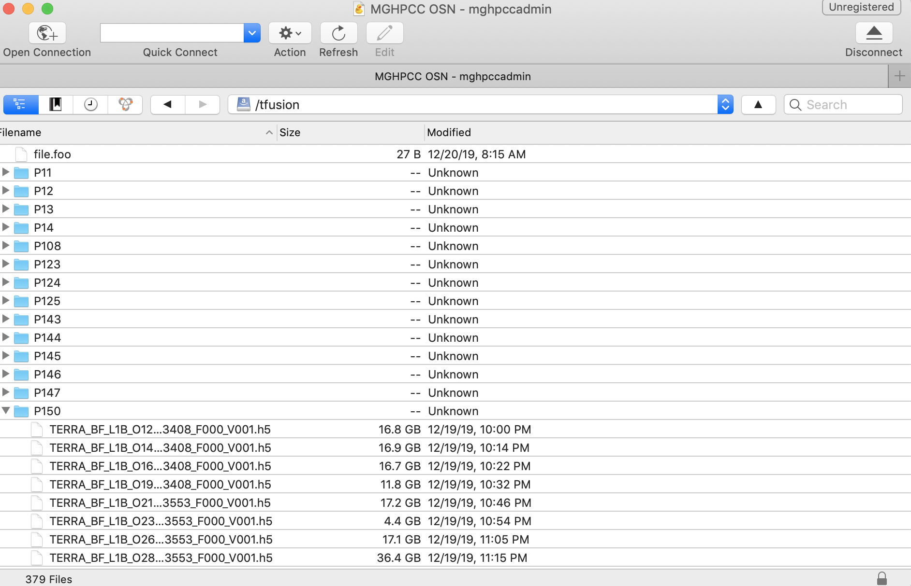

Accessing Datasets
==================

OSN supports a RESTful API that is compatible with the basic data access model of the 
`Amazon S3 API <https://docs.aws.amazon.com/AmazonS3/latest/API/Welcome.html>`_.
Any software that complies with that API can access data stored on the OSN.

There are three common methods for connecting to and using OSN resources:

#. OSN portal built-in web tools
#. Third party desktop applications (e.g. Cyberduck, Rclone)
#. Third party data management server applications (e.g. Globus and iRods)

OSN Portal Built-in Web Tools
-----------------------------
The OSN portal (`portal.osn.xsede.org <http://portal.osn.xsede.org>`_) supports
a simple UI that allows end users to browse allocations and to upload and 
download objects via the browser. This mode of access is most appropriate for 
browsing a dataset and uploading/downloading smaller files (typically <100G).

To use the built-in browser, a user logs onto the OSN portal and clicks on one
of the allocations that they have been granted access to. This brings the user
to a searchable/sortable table listing of the allocation and its subdirectories.
Clicking on any of the objects shown initiates a download of the object to the local disk.

To upload a file, the user locates the file on their local filesystem and drags the file to the browser window. This initiates an upload to the bucket location that the user is currently browsing.

OSN Basic Bucket Browser
^^^^^^^^^^^^^^^^^^^^^^^^

  OSN Basic Bucket Explorer

Third Party Applications
------------------------
There are numerous commercial and open source software tools for moving files to and 
from S3 buckets. These tools provide more sophisticated capabilities than the 
built-in browser tool including transfer management, multi-upload management, and 
provide configuration options that can help optimize data transfer for a given 
computer/network environment.

To use these tools, you will need to retrieve a pair of keys that are used to access
the buckets stored on OSN. To retrieve these keys, you can contact your data manager
and she will either give you keys or create an account for you on the OSN portal where
you can retrieve these keys. If your data manager creates a portal account for you and
gives you access to the keys you can visit `OSN Portal <https://portal.osn.xsede.org>`_
to retrieve them; the allocations you have access tto and their associated keys will
be listed on your home page.

  OSN Portal User Home page

Note that the "Bucket" information displayed in the portal has two components
(this will be important when you configure third party tools). 
The bucket information contains the OSN site/pod location and the specific 
allocation on that pod.

Cyberduck
^^^^^^^^^
Cyberduck is a popular file transfer tool that supports the S3 API.
The following describes how to configure Cyberduck to connect to an OSN resource.
Cyberduck is a "cloud storage browser" for Mac and Windows that supports multiple
storage providers/protocols.
The software may be downloaded at: `The Cyberduck Download Page <https://cyberduck.io/download/>`_ 

Using Cyberduck with OSN is straightforward.

#. Visit the OSN portal to retrive your Bucket location and allocation names (see image below)
#. Visit the OSN portal and retrieve your allocation keys or retrieve them from the data manager for your project
#. Open Cyberduck and select the bookmarks icon (see image below)
#. Click the add icon at the bottom left of the screen to create the bookmark 
#. Edit the new bookmark to point at the desired OSN pod using you allocation key pair

  Selecting the bookmarks page and adding new bookmark

When specifying the server, use the hostname portion of the location 
(i.e. if the location is https://mghp.osn.xsede.org the hostname is "mghp.osn.xsede.org").

When specifying "Port", use 443 if the location starts with "https";
use 80 if the location starts with "http".

  Adding OSN pod and user information to bookmark

Anonymous Access Data Sets
""""""""""""""""""""""""""
Some datasets provide anonymous read access; if you are accessing buckets anonymously,
type "anonymous" into the Access ID portion and Cyberduck will then select the grayed
out anonymous access box in the window.

  Using anonymous access as your user

Exit the window for the bookmark to save.

Browsing, Uploading, and Downloading
""""""""""""""""""""""""""""""""""""
Once a bookmark is created, you can use it to access data by double-clicking the bookmark.
This logs your user in and lists the contents of the dataset.

**Note:** If your buckets have large object counts, you will need to increase the Timeout
settings for connections.

Go to Preference > Connection and change the box next to Timeout for opening connections
(seconds) and change the setting to 90 seconds.

  Directory listing within bucket

Cyberduck client is a full-fledged transfer client so desktop up/downloads can be easily
performed for data sets.

The tool supports multiple upload/download streams, chunking, pausing and restarting.

Rclone
^^^^^^^

`Rclone <https://rclone.org/>`__ is a CLI program to manage files on
cloud storage. It's similar to rsync but provides many additional
features including support for over `40 cloud storage
products <https://rclone.org/#providers>`__.

macOS installation
""""""""""""""""""

Install Rclone via Homebrew
~~~~~~~~~~~~~~~~~~~~~~~~~~~~~~~

`Homebrew <https://brew.sh/>`__ is a 3rd party package manager for macOS
that can be used to easily install many FOSS packages. To install
Homebrew, please see the documentation on their
`website <https://brew.sh>`__ or simply run the following command:

::

   $ /bin/bash -c "$(curl -fsSL https://raw.githubusercontent.com/Homebrew/install/HEAD/install.sh)"

Once Homebrew is installed, install rclone by running the following
command:

::

   $ brew install rclone

Install Rclone without Homebrew
~~~~~~~~~~~~~~~~~~~~~~~~~~~~~~~

Alternatively, you can install rclone for macOS by running the
rclone-provided install.sh script which will download the relevant
precompiled binary.

::

   $ sudo -v ; curl https://rclone.org/install.sh | sudo bash

Linux installation
""""""""""""""""""

Installation of rclone for Linux can be done using your Linux
distribution specific package manager, or by using the rclone-provided
binary installer.

Note, if you are on a system where you do not have administrative
privledges, see the last section of the Linux installation documentation
on non-privledged installation.

Install Rclone using Linux package managers (requires root access)
~~~~~~~~~~~~~~~~~~~~~~~~~~~~~~~~~~~~~~~~~~~~~~~~~~~~~~~~~~~~~~~~~~

For RedHat or RedHat clone distros:

::

   $ sudo dnf install rclone

For Debian-based distros including Ubuntu:

::

   $ sudo apt install rclone

For Arch-based distros:

::

   $ sudo pacman -S rclone

Install Rclone binary directly (requires root access)
~~~~~~~~~~~~~~~~~~~~~~~~~~~~~~~~~~~~~~~~~~~~~~~~~~~~~

Alternatively, you can install rclone for Linux by running the
rclone-provided install.sh script which will download the relevant
precompiled binary.

::

   $ sudo -v ; curl https://rclone.org/install.sh | sudo bash

Non-privledged installation of Rclone on Linux
~~~~~~~~~~~~~~~~~~~~~~~~~~~~~~~~~~~~~~~~~~~~~~

If you are on an HPC system, first check to see if rclone is already
installed. For instance, if you are on a module-based system, you might
search for the rclone module.

::

   $ module spider rclone

If it is available, then you can ``module load rclone`` and then follow
the rest of this documentation.

If rclone is not available on your HPC system, you can install it into
your $HOME directory. First, fetch and unzip the precompiled rclone
binary.

::

   $ curl -O https://downloads.rclone.org/rclone-current-linux-amd64.zip
   $ unzip rclone-current-linux-amd64.zip
   $ cd rclone-*-linux-amd64

Place it in a directory that you have write access to and is in your
$PATH. If one is not available, you can create one.

::

   $ mkdir $HOME/bin
   $ cp rclone $HOME/bin
   $ export PATH=$PATH:$HOME/bin
   $ echo export PATH=\$PATH:$HOME/bin >> ~/.bashrc

*Note: The export and echo commands are for bash and other
bourne-compatible shells.*

Windows installation
""""""""""""""""""""

For Windows installtion, download the correct binary for your system. If
you are not sure, use the first download.

-  `Intel/AMD - 64
   Bit <https://downloads.rclone.org/rclone-current-linux-amd64.zip>`__
-  `Intel/AMD - 32
   Bit <https://downloads.rclone.org/rclone-current-linux-386.zip>`__
-  `ARM - 64
   Bit <https://downloads.rclone.org/rclone-current-linux-arm64.zip>`__

Once downloaded, open the file in Explorer and extract **rclone.exe**.
Rclone.exe is a portable binary and you can place it anywhere that is
convenient to call from CMD or powershell.

Rclone Configuration
""""""""""""""""""""
The most straightforward way to configure Rclone for OSN is to edit the rclone configuration file.
This file may be found by typing the command "rclone config file". 
The command will return the path to the rclone config file. 
Open this file with a text editor and add the following stanza to the end of the file: ::

	[<alias>]
	type = s3
	provider = Ceph
	access_key_id = <access key>
	secret_access_key =<secret key>
	endpoint = <location> 
	no_check_bucket = true

Where:
* <alias> – nickname of your choice for the allocation
* <access key> – the access key from the data manager or from the portal
* <secret key> – the secret key from the data manager of the portal
* <location> – the URL provided by the data manager or portal without the bucket 

An example of a configuration stanza might look like: ::

	[ocean-data]
	type = s3
	provider = Ceph
	access_key_id = ASasd8KJHDAKH**&asd
	secret_access_key =asd(*&Adskj*(*(&868778
	endpoint = https://mghp.osn.xsede.org
	no_check_bucket = true

Rclone Commands
"""""""""""""""
Rclone commands are of the form: ::

	$ rclone command alias:/bucket

So, using the example config file entry described above and assuming a bucket named "phytoplankton",
one would list the content of the bucket using the following command: ::

	$ rclone ls ocean-data:/phytoplankton

You could copy a local file to the bucket with the command: ::

	$ rclone copy my-local-file.dat ocean-data:/phytoplankton

Rclone offers a wide range of commands for performing typical unix file operations (ls, cp, rm, rsync, etc.). 
Details on these commands can be found on the `RCLONE documentation page <https://rclone.org/docs/>`_.

AWS CLI with OSN
^^^^^^^^^^^^^^^^^^^^^^^^^^

Install the AWS CLI utility:

`Official instructions to
install <https://docs.aws.amazon.com/cli/latest/userguide/getting-started-install.html>`__
the lastest AWS command line interface

After installing the AWS CLI, create a “config” file, ``~/.aws/config``,
with

::

   [yourprofilename]
   output=json

and add a corresponding credentials entry in your “credentials” file,
``~/.aws/credentials``, with

::

   [yourprofilename]
   aws_secret_access_key = your_secret_key
   aws_access_key_id = your_access_key

Your profile name is the one listed on the OSN storage page, with
project ID+name. For example:

::

   XYZ123415_Bob_Smith

After loading your ``aws-cli`` environment, you can use s3 commands such
as:

::

   aws s3 ls <yourbucket> --profile <yourprofilename> --endpoint <yourendpoint> --recursive --human-readable --summarize

Recall that if a bucket url is https://mghp.osn.xsede.org/phytoplankton, then <yourbucket> is phytoplankton, and <yourendpoint> is https://mghp.osn.xsede.org.

Third Party Data Management
---------------------------
OSN users may also choose to layer more sophisticated data management applications on top of the S3 API
services that OSN provides.
Two applications that have been used with OSN include Globus (using the Globus S3) connector and iRods.
Both packages have detailed descriptions on how to connect the service with a S3 storage provider.

Globus with OSN
^^^^^^^^^^^^^^^^^^^^^^^^^^

OSN does not provide a Globus instance. You must provide your own. In order to use Globus with OSN, you must have the `AWS Web Services S3 Connector <https://docs.globus.org/premium-storage-connectors/v5/aws-s3/>`__ installed and configured in your Globus instance.

After installing the Globus Connector, you can run the following commands to configure your OSN bucket as a Globus collection.

Create a storage gateway: 
::

	globus-connect-server storage-gateway create s3 collection_name --s3-endpoint https://site.osn.xsede.org --bucket bucket-name --s3-user-credential --domain your.globus.domain

Find the Storage Gateway ID:
::
	globus-connect-server storage-gateway list

Create a Globus collection:
::
	globus-connect-server collection create 12345678-9abc-defg-hijk-lmnopqrstuvw / "collection_name" --organization "Name of your Organization" --contact-email youremail@your.domain
