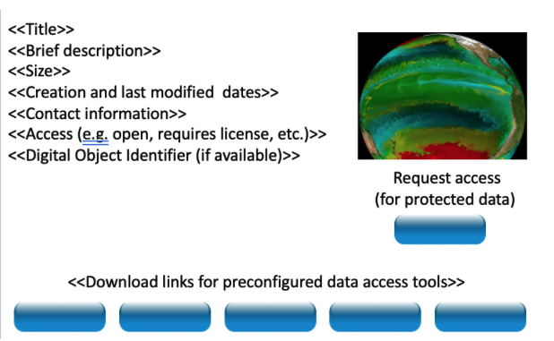
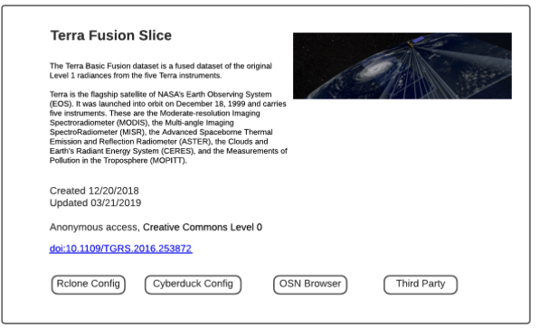

Landing Pages
=============
Coming Soon!
The data set owner may also create a landing page that follows DOI landing page conventions, 
making it easy to visit from a browser or data catalog.
The landing page contains metadata that describes the data set and links to preconfigured,
downloadable tools for accessing the data set.
OSN provides tools to create a Basic landing page that may be overridden by more sophisticated
landing pages depending upon the needs of the End User community.
The landing page has the following generic template.

  Sample landing page

A completed template example is shown below.

  Template Example

