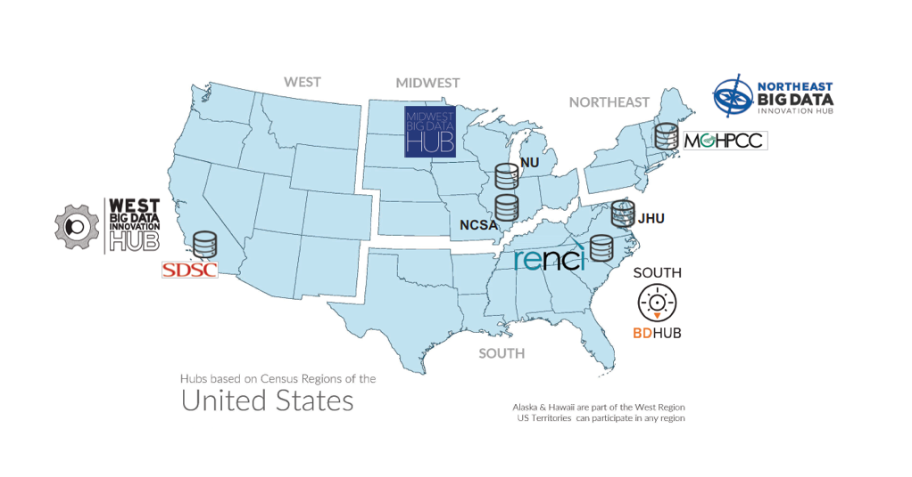
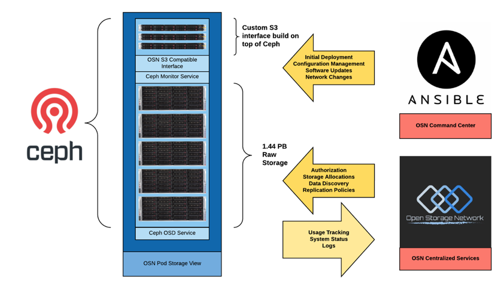

System Overview
===============
OSN data is housed in storage pods interconnected by national, high-performance networks
creating well-connected, cloud-like storage that is easily accessible at high data
transfer rates comparable to or exceeding the public cloud storage providers, where
users can temporariy park data, for retrieval by a collaborator or create a
repository of active research data.

This user guide is designed for the following categories of OSN user:

* End Users who wish to view metadata and retrieve data.
* Data Curators who maintain data sets
* Data Managers who grant access to data sets for Curators and End Users

Configuration
-------------
Key characteristics of OSN storage are:

* Ability to access data from anywhere via a RESTful interface that follows S3 conventions
* Federated identity management, allowing access to protected information with existing identity via InCommon or commercial services
* High speed access and transfer via national research and education networks
* Security and data integrity

OSN storage pods are located in science DMZs at Big Data Hub sites, interconnected 
by national, high-performance networks. 5 petabytes of storage are currently 
available for allocation.

  OSN Pod Deployment at six sites as of January, 2021

  OSN Storage Pod

File Systems
------------
OSN Storage is disk based and primarily intended to house active data sets.
OSN storage is allocated from the pod(s) closest to the requestor with capacity
to fulfill the request. Allocations of a minimum 10 terabytes and a maximum of 
50 terabytes can be requested through the XRAS process. If your project needs
more than 50 terabytes, please contact the OSN team directly to discuss before
you submit your request.

The OSN supports two types of data sets:

#. Open Access Data Sets that are readable by anyone and writable by Curators and Data Managers.
#. Protected Access Data Sets that are readable by invitation from a data manager and writable by Curators and Data Managers.

Every data set is a collection of objects that are individually and uniquely accessible
from anywhere. For Open Access data sets, an S3 RESTful interface allows users to
manipulate storage objects simply by issuing commands in the form of Uniform 
Resource Identifiers. 

For Protected Access Data Sets, the user first obtains an access key which is then
embedded into the access command. Examples of each are provided below.

**Coming soon:** Consistent with FAIR principles, every OSN data set will have a landing page
that makes it easy to "visit" a data set from a browser, search engine, or data catalog.
The landing page contains metadata that describes the data set, along with the links
to preconfigured, downloadable tools for accessing the data.

An active research data set can remain in OSN storage up to five years and usage
must comply with the OSN Acceptable Use Policy.

